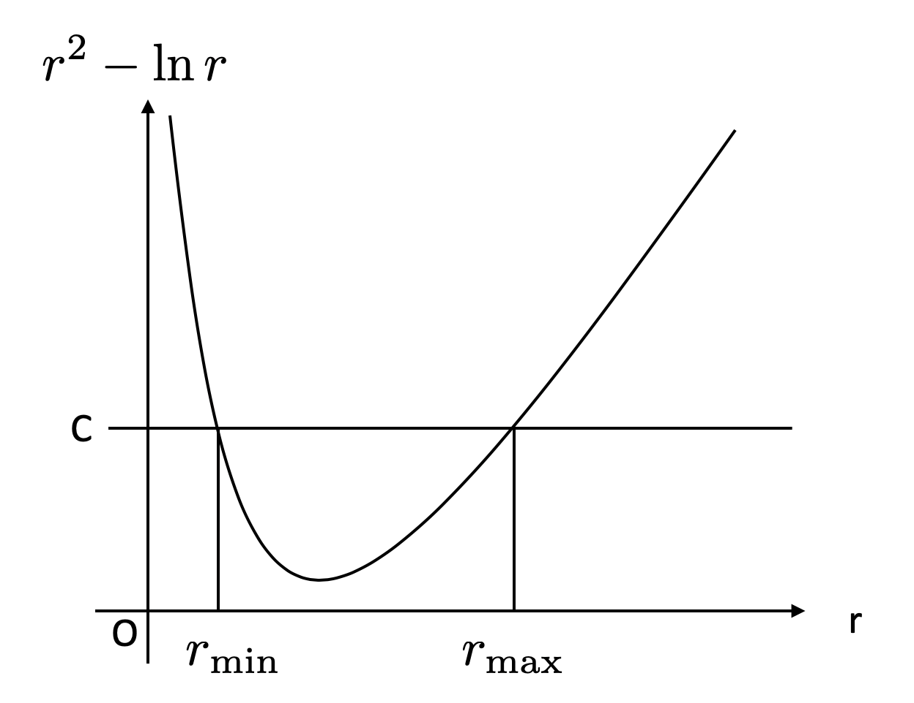
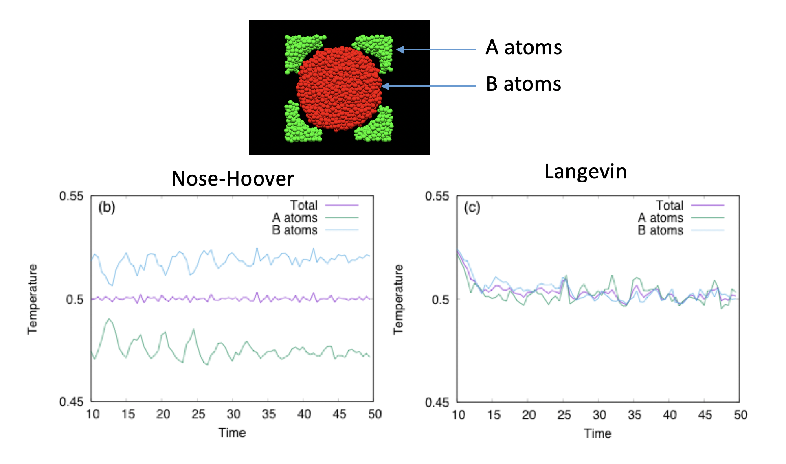
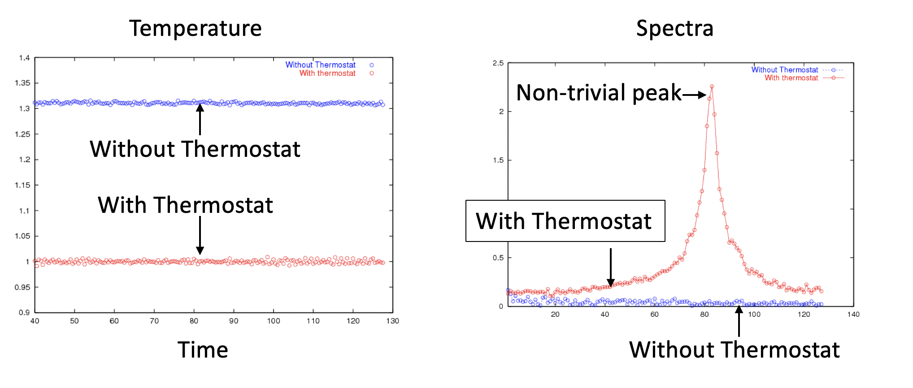
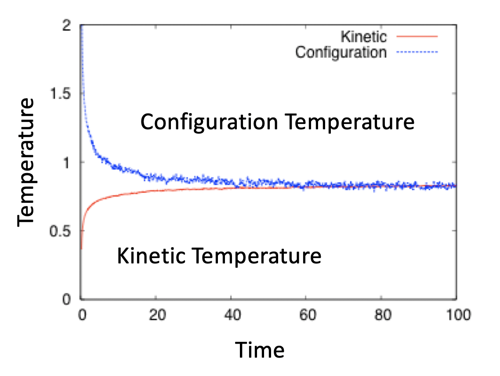

# 5. Nose-Hoover Method

## 5.1 Temperature Controll

熱力学における自然な変数には、内部エネルギーや圧力、体積、温度やエントロピーなどがある。これらの変数は示量性の量と示強性の量にわけることができる。さて、「お互いにかけてエネルギーになる示量性の量と示強性の量の組」は共役な量と呼ばれる。

例えば体積$V$と圧力$P$、エントロピー$S$と温度$T$、粒子数$N$と化学ポテンシャル$\mu$が互いに共役であり、それぞれ前者が示量性、後者が示強性の量である。

さて、世の中の量は「a priori」に認める量と、その量から導かれる量の二種類があるのであった。我々は一般に示量性の量をa prioriに認めることが多い。例えば「長さ」は知っているものとするから、体積$V$はa prioriに認め、共役な量である圧力$P$はそこから導かれる量とする。個数$N$も基本的な量として、相方である化学ポテンシャル$\mu$はそこから定義される量である。

分子動力学法では、示強性の量を制御したい場合がある。先ほど、圧力$P$を制御するのに、共役な量の相方である体積$V$をコントロールした。これはわかりやすい。

では、温度$T$を制御するにはどうすればよいだろうか？圧力制御からの類推では、エントロピーをコントロールすることになるが、エントロピーとはどうやってコントロールすればよいのだろうか。そもそもエントロピーと温度、どちらが基本的な量であり、どちらを従属的な量であろうか？この問いへの回答は筆者の能力を超える。ここでは「両方の立場があり得る」とだけコメントしておく。例えば田崎さんの熱力学の教科書は温度を基本的な量に取ってエントロピーを導く形式であり、清水さんの教科書はエントロピーを基本的な量に取って温度を導く形式である。

いずれにせよ、「温度の制御」は、何を制御した結果が温度が制御されているのか、あまり自明でないことは指摘しておきたい。

さて、熱力学、統計力学などで、系のサイズが大きくなると、ミクロカノニカルとカノニカルの差が小さくなることを学んだであろう。従って、もし事前に所望の温度$T$に対応する全エネルギーの期待値$\left<H\right>_T$がわかっていたなら、エネルギー$E= \left<H\right>_T$を与えて時間発展させれば、所望の温度における物理量の期待値が得られる。

しかし、そのためには、任意の温度におけるエネルギーの期待値がわかっていなければならない。

温度とエネルギーの関係は、比熱(specific heat)$C$を用いて

$$
C= \frac{\partial E}{\partial T}
$$

で表される。したがって、温度$T$における全系のエネルギー$E$は、

$$
E = \left<H\right> = \int_0^T C dT
$$

で与えられる。

さて、エネルギーの期待値は分配関数$Z$を用いて

$$
\left<H\right> = -\frac{\partial \ln Z}{\partial \beta}
= k_B T^2 \frac{\partial \ln Z}{\partial T}
$$

で与えられる。すなわち、比熱の温度依存性$C(T)$がわかる、ということは、その系の分配関数$Z(T)$がわかる、ということと同義である。分配関数がわかるということは、その問題が解けているということになる。

もちろん、通常は分配関数をあらかじめ求めることは困難であるから、比熱の温度依存性もシミュレーションを行う前にはわからない。従って、ある温度$T$におけるエネルギーの期待値も事前にはわからないために、温度制御が必要になるのである。

これまで、多くの温度制御法が提案されてきた。

* Velocity Scaling
* Gaussian Thermostat
* Berendsen Thermostat
* Nose-Hoover Thermostat
* Langevin Thermostat

このうち、現在でも広く用いられているのはBerendsen、Nose-Hoover、そしてLangevinであろう。以下では、Nose-Hoover法について説明する。

## 5.2 Nose-Hoover Method

### 5.2.1 Nose's Hamiltonian to Nose-Hoover Method

Andersenの方法では、系のサイズパラメタをスケールすることで圧力を制御した。同様に、能勢は時間をスケールすることで温度を制御する方法を考案した。

能勢のハミルトニアンは以下で与えられる。

$$
H_\mathrm{Nose} = H(p/s, q) + \frac{p_s^2}{2Q} + \frac{\ln s}{\beta}
$$

運動方程式は以下の通り。後で時間のスケールをする都合上、時間微分を陽に書いている。

$$
\begin{aligned}
\frac{dq}{dt} &= \frac{1}{s} \partial_1 H(p/s, q) \\
\frac{dp}{dt} &= -\frac{\partial H(p/s,q)}{\partial q} \\
\frac{d p_s}{dt} &= \frac{p}{s^2}\partial_1 H(p/s, q) - \frac{1}{s\beta}\\
\frac{ds}{dt} &= \frac{p_s}{Q}
\end{aligned}
$$

ただし、$\partial_1$は多変数関数の一つ目の変数に関する微分という意味である。

能勢の方法は、スケール変換された現実の系が指定温度のカノニカル分布に従うというものだが、時間のスケーリングが煩雑であった。そこで、HooverはNoseの運動方程式を変形し、簡単な形にした。

ここで、$p/s = p'$、$dt' = dt/s$という変換を考える。

まず、$q$について、$p/s = p'$を考えると、

$$
\frac{dq}{dt} = \frac{1}{s} \frac{\partial H}{\partial p'}
$$

時間を$t$から$t'$に変えると、

$$
\frac{dq}{dt'} = \frac{\partial H}{\partial p'}
$$

次に、$p'=p/s$について考えてみよう。$p'$を時間微分すると、

$$
\begin{aligned}
\frac{d p'}{dt} &= \frac{1}{s}\frac{d p}{dt} -\frac{p}{s^2} \frac{ds}{dt} \\
&= -\frac{1}{s} \frac{\partial H}{\partial q} - \frac{p'}{s} \frac{p_s}{Q}
\end{aligned}
$$

時間を$t$から$t'$に変えると、

$$
\frac{dp'}{dt'} = - \frac{\partial H}{\partial q} -p' \zeta
$$

ただし$\zeta = p_s/Q$である。

次に、$\zeta$の時間微分を考えよう。

$$
\begin{aligned}
\frac{d \zeta}{dt} &= \frac{1}{Q} \frac{d p_s}{d t} \\
&= \frac{1}{Q} \left(
    \frac{p}{s^2}\partial_1 H(p/s, q) - \frac{1}{s\beta}
\right) \\
&= \frac{1}{Qs}
\left(
p' \frac{\partial H}{\partial p} - \frac{1}{\beta}
\right)
\end{aligned}
$$

時間を$t$から$t'$に変えると、

$$
\frac{d \zeta}{dt'} = \frac{1}{Q}
\left(
p' \frac{\partial H}{\partial p} - \frac{1}{\beta}
\right)
$$

さて、あらためて$t', p'$を$t,p$と表記すると、運動方程式は

$$
\begin{aligned}
\dot{q} &= \frac{\partial H}{\partial q} \\
\dot{p} &= - \frac{\partial H}{\partial p} - p\zeta \\
\dot{\zeta} &= \frac{1}{Q}\left(
p \frac{\partial H}{\partial p} - \frac{1}{\beta}
\right)
\end{aligned}
$$
となり、これをNose-Hoover法と呼ぶ。この方程式が定常状態として指定の温度のカノニカル分布を持つことは後で証明する。

### 5.2.2  Nose's Conserved Quantity

先程の運動方程式は$(p,q,\zeta)$で閉じてしまい、$s$に関する式が含まれていなかった。これについて見てみよう。

もともと能勢のハミルトニアンはこのような形であった。

$$
H_\mathrm{Nose} = H(p/s, q) + \frac{p_s^2}{2Q} + \frac{\ln s}{\beta}
$$

この、最後の$\ln s/ \beta$を改めて$\eta$と定義しよう。$\eta$の時間微分は

$$
\begin{aligned}
\frac{d\eta}{dt} &= \frac{1}{\beta s}\frac{ds}{dt} \\
&= \frac{1}{\beta s} \frac{p_s}{Q} \\
&= \frac{\zeta}{\beta s}
\end{aligned}
$$

さらに$t$から$t'$に移ると

$$
\frac{d \eta}{d t'} = \frac{\zeta}{\beta}
$$

これも含めれば運動方程式は、

$$
\begin{aligned}
\dot{q} &= \frac{\partial H}{\partial q} \\
\dot{p} &= - \frac{\partial H}{\partial p} - p\zeta \\
\dot{\zeta} &= \frac{1}{Q}\left(
p \frac{\partial H}{\partial p} - \frac{1}{\beta}
\right) \\
\dot{\eta} &= \frac{\zeta}{\beta}
\end{aligned}
$$

となる。$(p,q,\zeta)$で運動方程式が閉じているので、$\eta$の時間発展を計算する必要は無いが、$\eta$まで考えると、もともとの能勢のハミルトニアン

$$
H_\mathrm{Nose} = H(p/s, q) + \frac{p_s^2}{2Q} + \eta
$$

が時間不変量になっていることがわかる。もともと能勢の方法では、ハミルトンの運動方程式に従うために、能勢のハミルトニアンが保存量となっていたのだが、変数変換を行ってハミルトンの運動方程式でなくなった今でも、これは時間不変量のままとなっている。この量を能勢の保存量、もしくはNose-Hoover保存量と呼ぶことがある。

$\eta$そのものは時間発展には不必要だが、Nose-Hoover保存量を見ることで時間発展の精度を確認するために計算される場合がある。

### 5.2.3 Different way to derive Nose-Hoover method

先程は能勢のハミルトニアンから導出された運動方程式を、変数変換することでNose-Hoover法が導出された。以下では逆に、「定常状態として指定の温度のカノニカル分布が実現するとしたら、運動方程式はどのような形でなければならないか」を考えてみよう。以下、簡単のために一自由度系を考える。

今、カノニカル分布を実現したいハミルトニアン$H_0(p,q)$があるとする。実現したい分布は

$$
f(p,q) \sim \exp(-\beta H)
$$

である。ただし、$\beta = 1/kT$は逆温度である。この位相空間は$(p,q)$で張られている。

さて、この分布を直接実現するのは難しそうなので、自由度$\zeta$を追加し、拡大された位相空間$(p,q,\zeta)$を考える。この空間で、$\zeta$も含めたカノニカル分布

$$
f_\mathrm{ex}(p,q,\zeta) \sim \exp(-\beta H)\exp\left(-\beta \frac{Q \zeta^2}{2}\right)
$$

を考えよう。$Q$の意味は後述する。もしこの分布が実現されたなら、$\zeta$に関して積分してしまうことで、所望の分布$f$を得ることができる。

$$
f_0 = \int_{-\infty}^{\infty} f_\mathrm{ex} d \zeta \sim \exp(-\beta H) 
$$

さて、拡大された位相空間$(p,q,\zeta)$に、先程の分布関数$f$を定常状態に持つような運動方程式を導入したい。ハミルトンの運動方程式の場合には「作用を最小化する」という変分原理から運動方程式が導けたが、温度制御された系にはそのような変分原理は存在しないので、適当に決めることになる。

とりあえずハミルトニアンの運動方程式をなるべく修正しない方向で検討しよう。温度制御のため、運動量$p$と追加自由度$\zeta$の相互作用は必要であろう。そこで、以下のような運動方程式を考えてみる。

$$
\begin{aligned}
\dot{p} &= -\frac{\partial H}{\partial q} - \phi_p(p,\zeta) \\
\dot{q} &= \frac{\partial H}{\partial p} \\
\dot{\zeta} &= \phi_\zeta(p,q,\zeta)
\end{aligned}
$$

我々の目標は、このダイナミクスが拡張された空間でのカノニカル分布$f_\mathrm{ex}$を定常状態に保つように$\phi_p$や$\phi_\zeta$を決めることである。

いま、位相空間が$\Gamma = (p,q,\zeta)$で張られており、そこに速度場$\dot{\Gamma} = (\dot{p},\dot{q},\dot{\zeta})$が定義されているとしよう。この空間の分布関数$f_\mathrm{ex}$を考えると、分布関数と速度場の積$\dot{\Gamma} f_\mathrm{ex}$が流れ場$J$となる。確率の保存則から、分布関数は以下の連続の式を満たす。

$$
\frac{\partial f_\mathrm{ex}}{\partial t} = 
- \mathrm{div} \underbrace{J}_{\dot{\Gamma} f_\mathrm{ex}}
$$

もし$f_\mathrm{ex}$が定常状態なら時間微分がゼロとなるので、

$$
\mathrm{div} \left( \dot{\Gamma} f_\mathrm{ex}\right) = 
  \frac{\partial}{\partial p} (\dot{p} f_\mathrm{ex})
+ \frac{\partial}{\partial q} (\dot{q} f_\mathrm{ex})
+ \frac{\partial}{\partial p} (\dot{\zeta} f_\mathrm{ex}) 
=0
$$

ここで、

$$
\begin{aligned}
\frac{\partial f_\mathrm{ex}}{\partial p} &= - \beta \frac{\partial H}{\partial p} f_\mathrm{ex}\\
\frac{\partial f_\mathrm{ex}}{\partial q} &= -\beta \frac{\partial H}{\partial q} f_\mathrm{ex}\\
\frac{\partial f_\mathrm{ex}}{\partial \zeta} &= - \beta Q \zeta f_\mathrm{ex}\\
\end{aligned}
$$

であることに注意して、一つ一つ愚直に計算していくと、

$$
\begin{aligned}
\frac{\partial}{\partial p} (\dot{p}f_\mathrm{ex}) &=
\left(
-\frac{\partial^2 H}{\partial p \partial q} - \frac{\partial \phi_p}{\partial p} +\beta\frac{\partial H}{\partial p} \frac{\partial H}{\partial q} + \beta \frac{\partial H}{\partial p} \phi_p   
\right) f_\mathrm{ex} \\
\frac{\partial}{\partial q} (\dot{q}f_\mathrm{ex}) &= \left(
\frac{\partial^2 H}{\partial p \partial q}
-\beta\frac{\partial H}{\partial p} \frac{\partial H}{\partial q}
\right)f_\mathrm{ex} \\
\frac{\partial}{\partial \zeta} (\dot{\zeta}f_\mathrm{ex}) &=
\left( \frac{\partial \phi_\zeta}{\partial \zeta} -\beta Q \zeta \phi_\zeta
\right)f_\mathrm{ex}
\end{aligned}
$$

となる。整理すると、

$$
-\frac{\partial \phi_p}{\partial p} + \beta \frac{\partial H}{\partial p} \phi_p
+ \frac{\partial \phi_\zeta}{\partial \zeta} - \beta Q \zeta \phi_\zeta = 0
$$

が満たされなければならない。ここで、ハミルトンの運動方程式由来の項が消えていることに注意しよう。ハミルトンの運動方程式が作る流れは非圧縮であるので、圧縮性流れに寄与しない。

さて、逆に上式が満たされれば、どのような$\phi_p, \phi_\zeta$を与えようとも、カノニカル分布が定常状態に持つような運動方程式を作ることができる。

まず、簡単のために$\phi_\zeta$が$\zeta$に依存しないとしよう。すると

$$
\frac{\partial \phi_\zeta}{\partial \zeta} = 0
$$

となる。次に、$p$と$\zeta$の相互作用を決める$\phi_p$について、$p$と$\zeta$を含む最も簡単な非線形関数である$p \zeta$としてしまおう。すると、満たすべき式は、

$$
-\zeta + \zeta \beta p \frac{\partial H}{\partial p} - \beta Q \zeta \phi_\zeta = 0
$$

となる。$\phi_\zeta$について解くと、

$$
\phi_\zeta = \frac{1}{Q}\left(
p\frac{\partial H}{\partial p} - \frac{1}{\beta}
\right)
$$

以上から、運動方程式は

$$
\begin{aligned}
\dot{p} &= - \frac{\partial H}{\partial q} - p \zeta \\
\dot{q} &= \frac{\partial H}{\partial p} \\
\dot{\zeta} &= \frac{1}{Q}\left(
p\frac{\partial H}{\partial p} - \frac{1}{\beta}
\right)
\end{aligned}
$$

これはNose-Hoover法にほかならない。要するにNose-Hoover法とは、

* 系に一つ自由度$\zeta$を追加し、
* 自由度を追加した世界でのカノニカル分布を実現するように運動方程式を修正したもの

に過ぎない。そこになんらかの物理的な意味を認めるかどうかは、研究者の間で意見が別れている。

### 5.2.4 Nose-Hoover Conserved Quantity

さて、Nose-Hoover法には、Noseのハミルトニアンに由来する保存量がある。この量を知らないものとして、導出してみよう。

まず、Nose-Hoover法が実現する、拡張された空間におけるカノニカル分布は以下のように書かれる。

$$
f_\mathrm{ex}(p,q,\zeta) \sim \exp(-\beta H)\exp\left(-\beta \frac{Q \zeta^2}{2}\right)
$$

ここで$H$は、もともと我々がカノニカル分布を実現したいハミルトニアンであった。さて、これを見ると、拡張されたハミルトニアン

$$
H_\mathrm{ex} = H + \frac{Q \zeta^2}{2}
$$

に対するカノニカル分布に見える。そこで、この拡張されたハミルトニアンの時間微分を計算してみよう。

$$
\begin{aligned}
\dot{H_\mathrm{ex}} &= \dot{H} + Q \zeta \dot{\zeta} \\
&= \frac{\partial H}{\partial p} \dot{p}
+ \frac{\partial H}{\partial q} \dot{q}
+ \zeta \left( p \frac{\partial H}{\partial p} - \frac{1}{\beta}\right) \\
&= -p\zeta \frac{\partial H}{\partial p} + p \zeta \frac{\partial H}{\partial p} - \frac{\zeta}{\beta}\\
&= - \frac{\zeta}{\beta}
\end{aligned}
$$

ほとんどの項がキャンセルするのだが、最後に少しゴミが残る。そこで、時間微分がこのゴミとキャンセルするような新たな自由度$\eta$を導入しよう。

$$
\dot{\eta} = \frac{\zeta}{\beta}
$$

定義から自明だが、$H_\mathrm{ex} + \eta$は時間保存量となる。これは、Nose-Hoover保存量と一致する。能勢のハミルトニアンからNose-Hoover法を導出した時には、Nose-Hoover保存量は能勢のハミルトニアン由来という意味があったが、「分布関数がカノニカル分布になるべし」という立場からNose-Hoover法を導くと、拡張されたハミルトニアンの時間微分のゴミをキャンセルしただけのように見える。その物理的解釈については読者に委ねる。

## 5.3 Problems on Nose-Hoover method

Nose-Hoover法は実装が容易であり、他の熱浴(例えばVelocity Scaling法やBerendsenの方法)と違って厳密にカノニカル分布を定常状態に持つことから広く使われている。しかし、Nose-Hoover法で温度制御された系が、意図する状態にならない場合がある。広く知られているのは調和振動子にNose-Hoover法を適用するとエルゴード性が破れる例だが、他にもいくつか問題がある。以下ではNose-Hoover法を使う上での注意点について述べる。

### 5.3.1 Ergodicity of the Nose-Hoover Method

Nose-Hoover法が保証するのは「位相空間をボルツマン重みに比例して走る」ということだけである。さらに「軌道が位相空間をくまなく走る」という条件が満たされて初めて、定常状態が指定温度のカノニカル分布となる。この条件をエルゴード性と呼ぶ。

エルゴード性の定義は難しい。一般的には、時間平均とアンサンブル平均が等しいことを持ってエルゴード的であると定義する。逆に、時間平均とアンサンブル平均が一致しない場合、「エルゴード性が破れている」と表現する。厳密さを犠牲にした表現をすれば、力学系において「長時間極限で到達可能性のある領域全てに到達可能」であればエルゴード的、そうでなければ非エルゴード的と呼ぶ。

さて、Nose-Hoover法は条件によってはエルゴード性を失うことが知られている。以下では、エルゴード性を失うとはどういうことか、エルゴード性はなぜ失われるか、どうすればエルゴード性を回復するかを見てみよう。

一次元調和振動子系にNose-Hoover法を適用してみよう。質量を$1$、目標温度を$1$とすると、運動方程式は以下のようになる。

$$
\begin{aligned}
\dot{p} &= -q - p \zeta \\
\dot{q} &= p \\
\dot{\zeta} &= \frac{1}{Q}(p^2-1)
\end{aligned}
$$

さて、この運動方程式が、$(p,q,\zeta)$空間でどのような流れを作っているか見てみよう。

まず、ハミルトンの運動方程式由来の流れは以下の通り。

$$
\begin{aligned}
\dot{p} &= -q \\
\dot{q} &= p 
\end{aligned}
$$

この系は$C = p^2 + q^2$、すなわち原点を中心とした円軌道を時間不変量に持つ。従って、この運動方程式は$(p,q)$空間において、原点を中心として反時計回りに回転する流れを作っている。

Nose-Hoover法として追加された流れ場は以下の通り。

$$
\begin{aligned}
\frac{dp}{dt} &= -p\zeta \\
\frac{d\zeta}{dt} &= \frac{1}{Q}(p^2-1)
\end{aligned}
$$

よく見ると、この微分方程式は変数分離形になっているために求積できる。

$$
\frac{dp}{d\zeta} = \frac{Q p\zeta}{(p^2-1)}
$$

$$
\left(p - \frac{1}{p} \right)dp = -Q \zeta d\zeta
$$

ここから、以下の時間不変量を得る。

$$
C = \frac{p^2}{2} - \ln p + \frac{Q\zeta^2}{2}
$$

これは$(p,\zeta)$空間において閉曲線を作っており、先程の運動方程式はその閉曲線上を走る、やはり回転する流れを作っている。

以上をまとめると、調和振動子+Nose-Hoover系は位相空間に以下のような流れ場を作っている。

さて、調和振動子系のハミルトニアンは$H=p^2/2 + q^2/2$である。この系においてカノニカル分布が実現するとは、分布関数$f(p,q)$が、ボルツマン重み

$$
f \sim \exp(-\beta H)
$$

に従うことだ。ここで、エネルギーが高ければ高いほど、その分布の実現確率は指数関数的に低くなるが、ゼロではないことに注意したい。これから、調和振動子系にNose-Hoover法を適用すると、系に非自明な保存量が構築され、その結果としてエネルギーに下限、上限ができるためにカノニカル分布が実現しないことを示す。

まず、$(p,q)$空間において回転しているので、極座標を取るのが自然であろう。以下のように$(p,q)$から$(r, \zeta)$に変数変換する。

$$
\begin{aligned}
p &= r \cos \theta \\
q &= r \sin \theta \\
\end{aligned}
$$

ここから$(r,\zeta, \zeta)$の運動方程式を導こう。

まず、$r^2/2 = p^2/2 + q^2/2$であるから、両辺を時間で微分すると、

$$
\begin{aligned}
r\dot{r} &= p \dot{p} + q \dot{q} \\
&= p (-q-p\zeta) + pq \\
&= -p^2 \zeta \\
&= - r^2 \zeta \cos^2 \theta
\end{aligned}
$$

以上から、

$$
\begin{aligned}
\dot{r} &= -r \zeta \cos^2 \theta \\
\dot{\zeta} &= \frac{1}{Q}(r^2 \cos^2 \theta - 1)
\end{aligned}
$$

ここで、$Q$が十分に大きい場合、$r, \zeta$の運動は$\theta$に比べて非常に遅くなるであろう。そこで、$\theta$について平均を取る(断熱近似)。

$$
\begin{aligned}
\frac{d r}{dt} &= - \frac{r \zeta}{2} \\
\frac{d\zeta}{dt} &= \frac{1}{Q}\left(\frac{r^2}{2} - 1\right)
\end{aligned}
$$

これは$r,\zeta$に関して変数分離形になっている。

$$
\frac{d r}{d \zeta} = - \frac{r\zeta}{2} \frac{Q}{\left(r^2/2 - 1\right)}
$$

$$
\left(\frac{r}{2} - \frac{1}{r}\right) dr = -\frac{Q\zeta}{2} d\zeta
$$

ここから直ちに以下の時間不変量(第一積分)を得る。

$$
C = r^2 - \ln r + Q\zeta^2
$$

さて、$Q \zeta^2$はゼロより大きいので、

$$
r^2 - \ln r \le C
$$

ここで$r^2 - \ln r$は$r\rightarrow 0$もしくは$r\rightarrow \infty$で無限大となり、その間に最小値を取るような下に凸な関数である。それがある閾値以下に制限されているということは、$r$のとり得る値に下限と上限が存在する、ということを意味する。

もともと$H = r^2/2$であったから、これはエネルギーに非自明な下限と上限が設けられた、すなわち軌道が位相空間全体を埋め尽くさず、結果としてエルゴード性を失うことがわかる。

ここでは$Q$が大きいとして断熱近似を行ったが、実際にやってみると$Q$がある程度小さくても実効的に変数分離が起きて、エルゴード性が破れることがわかる。

たまに、エルゴード性が破れるのは系が単自由度である場合であり、多自由度系であれば問題ない、といった誤解を見かける。しかし、エルゴード性が破れるのは追加自由度$\zeta$が系の部分自由度と強く結合して非自明な保存量を構築するからであった。従って、多自由度系であっても同様なことが起き得るので注意が必要である。

この問題は早くから認識され、エルゴード性を回復する手法が提案された。最も簡単には、熱浴自由度を追加してしまう方法が考えられる。

代表的なものの一つはKinetic-Moments法で、これは$p$の高次のモーメントも制御する方法である。もう一つはNose-Hoover-Chain法で、追加自由度$\zeta$も、別の自由度で温度制御しよう、という方法だ。いずれも自由度が追加されているため、断熱近似しても変数分離形にならず、結果としてエルゴード性が破れない。

### 5.3.2 Non-uniform Steady State

Nose-Hoover法の問題として調和振動子でエルゴード性が破れる現象が有名であるが、実用上では他の現象が問題となることの方が多い。そのうちの一つは、「系の温度が非一様のまま定常状態となる」問題だ。

Nose-Hoover法が制御するのは「系全体の温度」つまり平均温度である。従って、平均温度が指定の温度になっていればNose-Hoover法から見れば温度が制御できているように見える。しかし、なんらかの原因により高温の領域と低温領域にわかれてしまい、それが定常化する場合がある。

典型例は相分離する系である。例えば液滴と気相の共存状態を作ろうとして、最初に真空中に液滴を置いて蒸発させることで定常状態を作ろうとすると、液滴は気化熱により温度が下がり、その分Nose-Hoover法は全体の温度を上げて対応しようとするため、低温の液滴と高温の蒸気に分かれて安定化してしまう。液滴と蒸気の相互作用は非常に弱いため、現実的な時間では温度が一様にならない。

上図は、二種の合金が相分離した例だ。Nose-Hoover法は全体だけを見て温度を制御した気になっているが、実はA原子とB原子それぞれの温度を見ると、異なる温度で固定されてしまっている。Langevin系では、全体も、A、B原子個別に見ても同じ温度に緩和していることがわかる。

この問題は、Nose-Hoover系のみならず、系全体の平均運動エネルギーを制御する熱浴(Velocity-Scaling, Berendsen, Kinetic-Momentsその他の他自由度熱浴)全てで起きる可能性がある。なお、Langevin熱浴は各自由度ごとに制御がかかるため、このような問題は生じない。

### 5.3.3 Non-trivial Oscillation

Nose-Hoover法は、新たに追加した自由度$\zeta$が、$(p,\zeta)$空間に回転流れを作ることは既に述べた。Nose-Hoover法を用いると、この回転に由来する「振動」が系に導入される。

上左図は、熱浴をつけてない場合とつけた場合の系の温度の時間発展だ。熱浴をつけていない系はおよそ1.3の温度を持つが、熱浴で$T=1$に制御した系は、意図通り温度が1付近で揺らいでいるように見える。

この温度の時間変化をフーリエ変換し、パワースペクトルを見てみよう。熱浴をつけていない場合は、原点に強いピークが立つが、それ以外の成分はほとんどゼロ、すなわちこの系の温度ゆらぎは、ほぼホワイトノイズとみなすことができる。

しかし、熱浴をつけた場合は、スペクトルに熱浴由来のピークが立つ。静的な性質を調べている場合はあまり問題とならないが、何かのゆらぎやスペクトルを調べている場合には、熱浴由来の振動と干渉しないように十分に注意しなければならない。この問題は温度を一階の遅れで制御するNose-Hoover系特有の問題であり、Velocity-Scaling法やBerendsen法では起きない。

### 5.3.4 Slow relaxation of Configuration Temperature

温度には「運動温度(Kinetic Tempearture)」と「状態温度(Configuration Temperature)」があることは既に述べた。それぞれ

$$
\left
 = k_B T
$$

$$
\left<q \frac{\partial H}{\partial q} \right> = k_B T
$$

と定義され、カノニカル分布について部分積分すると上記の式が証明できる。これらは平衡状態では一致するが、非平衡状態では一般に一致しない。

我々が温度依存性を知りたいのは、運動エネルギー部分ではなく、状態部分であることが多い。Nose-Hoover法を始めとする多くの熱浴は、運動温度を制御することで、「そのうち状態温度も指定の温度に緩和するだろう」ということを期待するが、一般に運動温度に比べて状態温度の緩和は遅い。

上図は、FCCに組んだLJ原子系の運動温度と状態温度の緩和を見たものだ。なお、温度制御はしておらず、純粋にハミルトンの運動方程式を解いている(そのため、運動温度が振動していない)。二つの温度は最終的に一致するが、二つの温度が異なることがわかるであろう。

特に系が相分離する場合や、ガラス系に見られるような遅い構造緩和を持つ場合は、状態温度の緩和は非常に遅くなる。このような時、運動温度しかモニターしていないと、自分が意図する温度とはずれた状態温度における振る舞いを観測してしまうので注意が必要である。

この問題は、決定論熱浴だけでなく、Langevin法などの確率的熱浴でも起こり得る。
