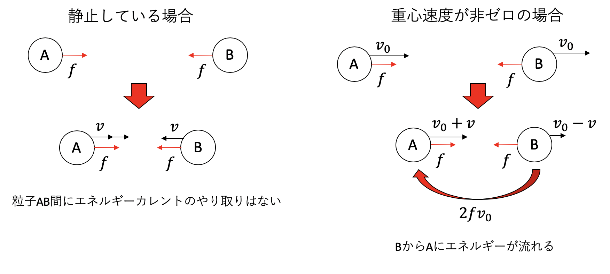

# 圧力

## 局所量定義の難しさ

MDシミュレーションをしていると、温度や圧力といった物理量の時間変化を見たくなる。さらに、系全体のマクロな量だけでなく、「系のこの部分の温度」「系のこの部分の圧力」といった局所的な量も知りたくなる。しかし、分子動力学法の支配方程式はハミルトンの運動方程式であるから、我々が使える「材料」は運動量、座標、そして全エネルギーだけである。これらの材料から欲しい物理量すべてを「調理」しなければならない。系全体の物理量はともかく、局所的な物理量定義は難しい。以下、その難しさを見てみよう。

### 一体関数の局所物理量

3次元$N$粒子系、二体相互作用系を考えよう。簡単のため、質量はすべて等しいとすると、ハミルトニアンは以下のように書ける。

$$
H = \sum_i \frac{\vec{p}_i^2}{2m} + \sum_{i < j} V(q_{ij})
$$

ただし、$q_ij \equiv |\vec{q}_i - \vec{q}_j|$である。

局所的な物理量とは、「系の部分的な空間を指定し、その部分空間で定義される量」である。一番簡単な量は局所数密度であろう。部分空間の中に含まれる粒子の数を数えて、空間の体積で割ればよい。これをちゃんと定義するために、数密度分布関数$\rho(\vec{r})$を作ろう。

$$
\rho(\vec{r}) = \sum_i \delta(\vec{r} - \vec{q}_i)
$$

ある部分空間$\Omega$における数密度$\rho_\Omega$は、上記の量を積分すれば得られる。

$$
\rho_\Omega = \frac{1}{|\Omega|}\int_\Omega \rho(\vec{r}) d \vec{r}
$$

先程の「$\Omega$の中の粒子数を数えて空間体積$|\Omega|$で割る」という文章を数式で書いただけであり、全空間にわたって積分すれば

$$
\rho = \frac{N}{V}
$$

になる。

同様に、局所的な運動温度$T_\Omega$を定義してみよう。

$$
\left< \frac{\vec{p}_i^2}{2m}\right> = \frac{3}{2}k_B T
$$

であったから、

$$
\frac{3}{2} k_B T_\Omega = \frac{|\Omega|}{\rho_\Omega} \int_\Omega \sum_i \frac{\vec{p}_i^2}{2m} \delta(\vec{r} - \vec{q}_i) d \vec{r}
$$

と定義するのが自然であろう。やはり全空間にわたって積分すれば

$$
\frac{3}{2} k_B T = \frac{1}{N} \sum_i \frac{\vec{p}_i^2}{2m}
$$

と、運動エネルギーの平均を計算しているだけであることがわかる。

### 二体関数の局所物理量の例：局所エネルギーとエネルギーカレント

一体関数で定義できる局所物理量は「その部分空間に含まれる粒子の平均」を取るだけで良いので簡単であった。しかし、粒子系の相互作用が効いてくるような二体以上の関数が関わってくると話がややこしくなる。そんな、二体関数が関係する物理量の例がエネルギーである。ハミルトニアンが

$$
H = \sum_i \frac{\vec{p}_i^2}{2m} + \sum_{i < j} V(q_{ij})
$$

と、一体の運動エネルギーと二体のポテンシャルエネルギーの和で書かれているため、エネルギーの計算には二体関数が関わってくる。このエネルギーの局所定義はどのようにすればよいだろうか？

最も単純には、エネルギーをなんらかの形で一体関数で表現してしまうことが考えられる。つまり、ハミルトニアン$H$を、各粒子に分配した$H_i$の和、

$$
H = \sum_i H_i
$$

として表現する。一体関数になってしまえば後は数密度関数などと「領域に含まれる範囲で数え上げる」手法が使えるので簡単である。さて、運動エネルギーはもともと一体関数であったが、ポテンシャルエネルギーは二体関数なのでなんとかしなければならない。ここでは単純に、相互作用する粒子に半分ずつ分けることにしよう。以下、簡単のため一次元かつ$m=1$とすると、

$$
\begin{aligned}
H&= \sum_i \frac{p_i^2}{2} +\sum_{i<j} V(q_{ij}) \\
&=  \sum_i \frac{p_i^2}{2} +\frac{1}{2}\sum_{i}\sum_{j \neq i} V(q_{ij}) \\
&= \sum_i \underbrace{\left( \frac{p_i^2}{2}   + \frac{1}{2} \sum_{j \neq i} V(q_{ij})\right)}_{\equiv H_i}  \\
&= \sum_i H_i
\end{aligned}
$$

とする。$H_i$を粒子$i$が持つエネルギーと解釈すれば、局所エネルギー密度関数を定義できる。

さて、このようにエネルギーの粒子への分配を定義すると、粒子間のエネルギー流を考えることができる。例えば粒子$i$に$j$から流れるエネルギーは、$i$粒子のエネルギーの変化分を$j$粒子からの寄与に分解するものであるから、
以下のように定義したい。

$$
\frac{d H_i}{dt} = \sum_{j \neq i} J_{i \leftarrow j}
$$

実際に$d H_i/dt$を計算してみる。

$$
\begin{aligned}
\frac{d H_i}{dt} &= p_i \dot{p}_i + \frac{1}{2} \sum_{j \neq i} V'(q_{ij})\dot{q}_{ij} \\
&=  p_i \sum_{j \neq i} F_{i \leftarrow j} - \frac{1}{2} \sum_{j \neq i} F_{i \leftarrow j} (p_i - p_j) \\
&=\sum_{j \neq i}  \underbrace{\frac{1}{2}  F_{i \leftarrow j} (p_i + p_j)}_{\equiv J_{i \leftarrow j}}
\end{aligned}
$$

ただし、運動量$p_i$の時間変化は、$i$にかかる力に比例し、その力は粒子$j$から粒子$i$にかかる力$F_{i \leftarrow j}$の総和であるから

$$
\dot{p}_i = - \frac{\partial H}{\partial q_i} \equiv \sum_{j \neq i} F_{i \leftarrow j}
$$

と表した。

ここから、

$$
\begin{aligned}
J_{i \leftarrow j} &\equiv \frac{1}{2}  F_{i \leftarrow j} (p_i + p_j) \\
&=  \frac{1}{2} (p_i F_{i \leftarrow j} - p_j F_{j \leftarrow i})
\end{aligned}
$$

と定義するのが自然であることがわかる。これは、右辺第一項が$j$から$i$に流れるエネルギー流、第二項が$i$から$j$に流れるエネルギー流で、その収支を表していると解釈できる。

さて、ここまでの定義には何も問題がないように見えるが、実はこのエネルギー流の定義はガリレイ不変ではない。いま、静止している二つの粒子$A$と$B$があり、引力相互作用が働いているとしよう。これらの粒子は引力によって動き始めるが、それぞれが得る運動エネルギーの増加分は、それぞれが持っていたポテンシャルエネルギーの減少分と相殺し、両者にエネルギーのやりとりはない。

さて、全く同様な条件で、二つの粒子に同じ方向に初速$v_0$を与えよう。しばらくして粒子$A$の速度が$v_0 + v$、粒子$B$の速度が$v_0 - v$となり、両者に力$f$がかかっているとすると、粒子AB間には、BからAにカレント$J_{A \leftarrow B} = 2 f v_0$が流れていることになる。

二つの粒子に同じ向きに初速$v_0$を与えるのも、速度$-v_0$で通り過ぎる観測者から見るのも同じことであるから、粒子間のエネルギー流は、重心速度や観測者との相対速度に依存する、ということを意味する。

これがどれくらい問題であるかは、何をやりたいかによる。大きな分子が相対距離を保ちながら並進運動をしている時に、「運動方向と逆向きに分子内にエネルギーが流れている」と解釈すべきかどうかは筆者にはわからないが、「奇妙だな」とは思うであろう。このように、物理量の局所定義は、数式的には自然でも、その解釈には「奇妙だな」と思う点がよく出てくる。

## 圧力定義

さて、二体関数がかかわる物理量の例として圧力を考えてみよう。粒子系の圧力はビリアル定理から求めることが多いのだが、ここでは「分子動力学法の世界にはハミルトニアンしか存在しない」という立場から、分配関数経由で導出する。

まず、熱力学関係式

$$
P = - \left(\frac{\partial F}{\partial V} \right)_T
$$

から出発しよう。$P$は圧力、$T$が温度、$F$はヘルムホルツ自由エネルギーである。

ヘルムホルツ自由エネルギーは分配関数$Z$を用いて

$$
F = - k_B T \ln Z
$$

と書けるので、

$$
\begin{aligned}
P &= - \left(\frac{\partial F}{\partial V} \right)_T\\
&= k_B T \frac{\partial\ln Z }{\partial V}
= k_B T \frac{1}{Z} \frac{\partial Z}{\partial V}
\end{aligned}
$$

となる。さて、分配関数はハミルトニアン$H$を用いて

$$
Z = \int d \Gamma \mathrm{e}^{-\beta H}
$$

であったから、

$$
\frac{\partial Z}{\partial V} = \int d \Gamma \left(-\beta \frac{\partial H}{\partial V} \right) \mathrm{e}^{-\beta H}
$$

である。これを先程の式に代入して整理すると、

$$
\begin{aligned}
P &= - Z^{-1} \int d \Gamma \left(\frac{\partial H}{\partial V} \right) \mathrm{e}^{-\beta H} \\
&= -\left< \frac{\partial H}{\partial V} \right>
\end{aligned}
$$

すなわち、圧力を求めるにはハミルトニアンの体積微分のアンサンブル平均を取れば良い。
もちろんこの式は、熱力学関係式

$$
P = - \left(\frac{\partial U}{\partial V} \right)_S
$$

に対応している。

さて、ハミルトニアンの体積微分を取るために、系のサイズを変化させることを考えよう。一辺$L$の立方体の系を考えると、$V=L^3$である。この系の長さを一様に$L \rightarrow \alpha L$と拡大することを考える。

拡大された世界のハミルトニアンは

$$
H(\alpha) = \sum_i \frac{\alpha^2 \vec{p}_i^2}{2m} + \sum_{i < j} \Phi(\alpha r_{ij})
$$

となる。

やや紛らわしいが、$\alpha = 1$の時の体積を$V$とすると、$V \rightarrow \alpha^3 V$となるから

$$
dV = 3 \alpha^2 V d \alpha
$$

となる(微分する変数としての$V$と基準体積$V$で同じ記号を使っていることに注意)。これにより、

$$
\frac{\partial H}{\partial V} = \lim_{\alpha \rightarrow 1} \frac{\partial H}{\partial \alpha} \frac{d \alpha}{dV}
$$
$V$による微分を$\alpha$による微分に置き換えることができる。以下、$\partial H/\partial \alpha$を計算しよう。

まず、運動エネルギー部分は簡単で、

$$
\lim_{\alpha \rightarrow 1}\frac{\partial K(\alpha)}{\partial \alpha} =
\lim_{\alpha \rightarrow 1} \sum_i \frac{2 \alpha \vec{p}_i^2}{2m} = 2K
$$

つまり、運動エネルギーの二倍である。

次にポテンシャル部分の計算であるが、

$$
r_{ij} = |\vec{r}_i - \vec{r}_j|
$$

$$
\vec{F}_{ij} = - \Psi'(r_{ij}) \frac{\vec{r}_i - \vec{r}_j}{|\vec{r}_i - \vec{r}_j|}
$$

であることに注意すると、

$$
\begin{aligned}
\lim_{\alpha \rightarrow 1} \frac{\partial \Psi(\alpha r_{ij})}{\partial \alpha} &= r_{ij} \Psi'(r_{ij}) \\
&= \sum_{i < j} \vec{F}_{ij} \cdot (\vec{r}_i - \vec{r}_j)\\
&= \sum_i \vec{F}_i \cdot \vec{r}_i
\end{aligned}
$$

ただし、途中で作用反作用の法則を用いた。

以上から、

$$
P = \frac{1}{3V} \left(2 K + \sum_i \vec{F}_i \cdot \vec{r}_i \right)
$$

いわゆるビリアル定理が導かれた。導出を見れば、分母の$3V$は$d\alpha /d V$から、運動エネルギーの2倍のファクターは$\alpha^2 \vec{p}_i^2$の$\alpha$微分から出てくることがわかるであろう。

TODO: まだところどころ符号が怪しい。
