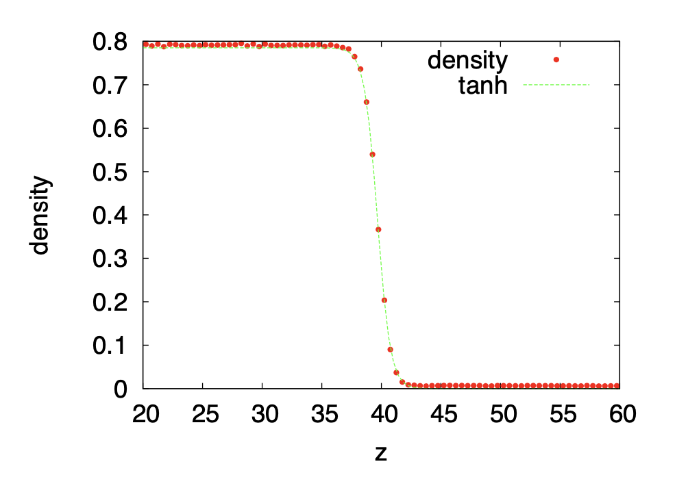
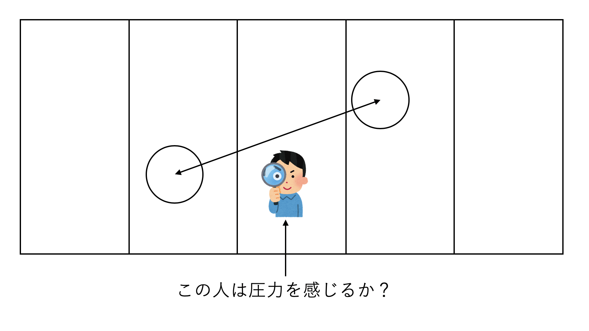
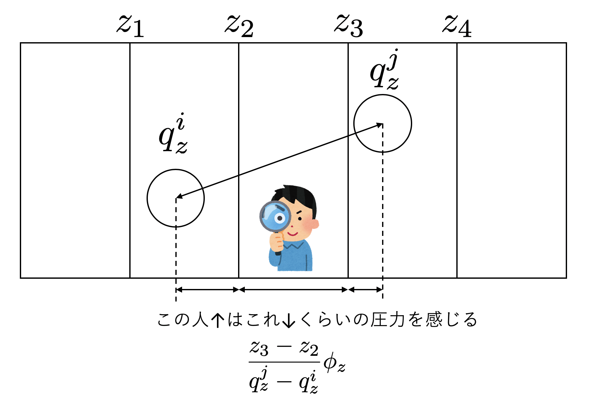

# 2. Pressure

しつこいが、分子動力学法において規定されているのは全エネルギーのみである。それ以外の物理量は我々が定義しなければならない。ここでは、圧力について考えてみよう。以下、系全体が感じる大域的な圧力と、局所的な圧力の定義について論じる。

## 2.1 Global Pressure

### 2.1.1 Virial Theorem

教科書によく書いてある古典的なビリアル定理から圧力を定義してみよう。天下りだが、以下のような量を考えよう。

$$
G = \sum_i \vec{p}_i \cdot \vec{q}_i
$$

両辺を時間微分してみる。

$$
\begin{aligned}
\dot{G} &= \sum_i \underbrace{\vec{p}_i \cdot \dot{\vec{q}}_i}_{(1)} + \sum_i \underbrace{\dot{\vec{p}}_i \cdot \vec{q}_i}_{(2)}
\end{aligned}
$$

まず(1)の項だが、$\dot{\vec{q}}_i = \vec{p}_i/m$であるから、

$$
\vec{p}_i \cdot \dot{\vec{q}}_i  = \frac{\vec{p}_i^2}{m}
$$

である。エネルギー等分配則から

$$
\frac{\vec{p}_i^2}{m} = 3 k_B T
$$

和を取ると、

$$
\sum_i \frac{\vec{p}_i^2}{m} = 3 Nk_B T
$$

次に、(2)だが、$\dot{\vec{p}}_i = \vec{f}_i$であるから、

$$
\dot{\vec{p}}_i \cdot \vec{q}_i = \vec{q}_i \cdot \vec{f}_i 
$$

ここで$\vec{f}_i$は、粒子$i$にかかる力である。ここで、粒子間に働く力と、外力$\vec{f}^\mathrm{ext}_i$にわけよう。粒子間力は二体力とし、粒子$j$から$i$に働く力を$\vec{f}_{ij}$とすると、

$$
\dot{\vec{p}}_i \vec{q}_i = \vec{q}_i \sum_{i\neq j} \vec{f}_{ij} + \vec{q}_i  \cdot \vec{f}^\mathrm{ext}_i
$$

と書ける。$i$に関する和を取ると、

$$
\begin{aligned}
\sum_i \dot{\vec{p}}_i \vec{q}_i &= \underbrace{\sum_i \vec{q}_i \sum_{i\neq j} \vec{f}_{ij}}_{(3)} + \underbrace{\sum_i \vec{q}_i \cdot \vec{f}^\mathrm{ext}_i}_{(4)}
\end{aligned}
$$

まずは(3)について計算しよう。

$$
\begin{aligned}
(3) &=  \sum_i \vec{q}_i \sum_{i\neq j} \vec{f}_{ij} \\
&= \sum_{i< j} \left( \vec{q}_i  \cdot \vec{f}_{ij} + \vec{q}_j  \cdot \vec{f}_{ji} \right) \\
&=  \sum_{i< j}\left( \vec{q}_i  \cdot \vec{f}_{ij} - \vec{q}_j  \cdot \vec{f}_{ij} \right) \\
&=  \sum_{i< j} \vec{q}_{ij} \cdot \vec{f}_{ij}
\end{aligned}
$$

ただし、$\vec{q}_{ij} = \vec{q}_i - \vec{q}_j$である。

次に、外力からの寄与(4)を計算する。$\vec{f}^\mathrm{ext}_i$は、外力から粒子$i$に働く力であるから、その反作用が壁に働く。従って、

$$
\begin{aligned}
(4) &= \sum_i \vec{q}_i \cdot \vec{f}^\mathrm{ext}_i \\
&= -  \int_{\partial V} \vec{r} \cdot (P\vec{n}) d A \\
&= -P \int_V \underbrace{\nabla \cdot \vec{r}}_3 dV \\
&= -3PV
\end{aligned}
$$

ただし、途中でガウスの定理を使った。また、

$$
\nabla \cdot \vec{r} = \frac{\partial x}{\partial x} +
\frac{\partial y}{\partial y} +
\frac{\partial z}{\partial z}  = 3
$$

を用いた。

以上から、

$$
\dot{G} = 3Nk_B T + \sum_{i< j} \vec{q}_{ij} \cdot \vec{f}_{ij} -3PV
$$

となった。

次に、両辺の時間平均を取ろう。時間変化する物理量$A(t)$の時間平均$\bar{A}$は、

$$
\bar{A} \equiv \lim_{\tau \rightarrow \infty} \frac{1}{\tau}
\int_0^\tau dt A(t)
$$

で定義される。$\dot{G}$の時間平均は

$$
\begin{aligned}
\bar{\dot{G}} &= \lim_{\tau \rightarrow \infty} \frac{1}{\tau}
\int_0^\tau dt \dot{G}(t)\\
&= \lim_{\tau \rightarrow \infty} \frac{G(\tau) - G(0)}{\tau}
\end{aligned}
$$

ここで、$G$という量に上限があるなら、十分に長い$\tau$を取ればゼロになる。以上から、

$$
\bar{\dot{G}} = 3Nk_B T + \overline{\sum_{i< j} \vec{q}_{ij} \cdot \vec{f}_{ij}} -3PV = 0
$$

時間平均$\bar{A}$とアンサンブル平均$\left< A\right>$を同一視すると、

$$
PV = N k_BT + \frac{1}{3} \left< \sum_{i< j} \vec{q}_{ij} \cdot \vec{f}_{ij}\right>
$$

これが古典的なビリアル定理による、粒子系の圧力の導出である。最初の$N k_B T$が理想気体からの寄与、つまり粒子の運動から圧力への寄与であり、右辺第二項が相互作用からの寄与である。

### 2.1.2 Derivation from Partition Function

さて、先ほどのビリアル定理からの圧力の導出では、

* いきなり$G$という量を定義して時間微分する意味が不明瞭
* 粒子にかかる力を粒子間力と外力に分けたが、周期境界条件ではどうなるかわかりにくい

という問題がある。そこで、「分子動力学法の世界にはハミルトニアンしか存在しない」という立場から、分配関数経由で導出してみよう。

まずはこの系のハミルトニアンを定義しよう。

$$
H = \sum_i \frac{\vec{p}_i^2}{2m} + \sum_{i < j} \Phi(q_{ij})
$$

これがこの系の全エネルギーを定義する。

さて、熱力学関係式

$$
P = - \left(\frac{\partial F}{\partial V} \right)_T
$$

から出発しよう。$P$は圧力、$T$が温度、$F$はヘルムホルツ自由エネルギーである。

ヘルムホルツ自由エネルギーは分配関数$Z$を用いて

$$
F = - k_B T \ln Z
$$

と書けるので、

$$
\begin{aligned}
P &= - \left(\frac{\partial F}{\partial V} \right)_T\\
&= k_B T \frac{\partial\ln Z }{\partial V}
= k_B T \frac{1}{Z} \frac{\partial Z}{\partial V}
\end{aligned}
$$

となる。さて、分配関数はハミルトニアン$H$を用いて

$$
Z = \int d \Gamma \mathrm{e}^{-\beta H}
$$

と書けるから、

$$
\frac{\partial Z}{\partial V} = \int d \Gamma \left(-\beta \frac{\partial H}{\partial V} \right) \mathrm{e}^{-\beta H}
$$

である。これを先程の式に代入して整理すると、

$$
\begin{aligned}
P &= - Z^{-1} \int d \Gamma \left(\frac{\partial H}{\partial V} \right) \mathrm{e}^{-\beta H} \\
&= -\left< \frac{\partial H}{\partial V} \right>
\end{aligned}
$$

すなわち、圧力を求めるにはハミルトニアンの体積微分のアンサンブル平均を取れば良い。
もちろんこの式は、熱力学関係式

$$
P = - \left(\frac{\partial U}{\partial V} \right)_S
$$

に対応している。

さて、ハミルトニアンの体積微分を取るために、系のサイズを変化させることを考えよう。一辺$L$の立方体の系を考えると、$V=L^3$である。この系の長さを一様に$L \rightarrow \alpha L$と拡大することを考える。

空間を一辺$\alpha$倍にすると、$\vec{q}_i \rightarrow \alpha \vec{q}_i$となる。ここで、

$$
\vec{p}_i = \frac{\partial L}{\partial \dot{\vec{q}}_i}
$$

であったから、$\vec{p}_i \rightarrow \vec{p}_i / \alpha$となることに注意すると、拡大された世界のハミルトニアンは

$$
H(\alpha) = \sum_i \frac{\vec{p}_i^2}{2\alpha^2m} + \sum_{i < j} \Phi(\alpha q_{ij})
$$

となる。

やや紛らわしいが、$\alpha = 1$の時の体積を$V$とすると、$V \rightarrow \alpha^3 V$となるから

$$
dV = 3 \alpha^2 V d \alpha
$$

となる(微分する変数としての$V$と基準体積$V$で同じ記号を使っていることに注意)。これにより、

$$
\frac{\partial H}{\partial V} = \lim_{\alpha \rightarrow 1} \frac{\partial H}{\partial \alpha} \frac{d \alpha}{dV} = \lim_{\alpha \rightarrow 1} \frac{\partial H}{\partial \alpha} \frac{1}{3 \alpha^2 V}
$$

と、$V$による微分を$\alpha$による微分に置き換えることができる。

以下、$\partial H/\partial \alpha$を計算しよう。

まず、運動エネルギー部分を考える。

$$
\begin{aligned}
\lim_{\alpha \rightarrow 1}\frac{\partial K(\alpha)}{\partial \alpha} &=
\lim_{\alpha \rightarrow 1} \sum_i \frac{\partial}{\partial \alpha } \frac{\vec{p}_i^2}{2\alpha^2 m} \\
&= -2K \\
&= -3 N k_B T
\end{aligned}
$$

ただし、途中でエネルギー等分配則を用いた。

次にポテンシャル部分の計算であるが、まずポテンシャル項の$\alpha$微分は

$$
\lim_{\alpha \rightarrow 1}  \frac{\partial\Phi(\alpha q_{ij})}{\partial \alpha} 
= \Phi'(q_{ij}) q_{ij} $$

ここで、

$$
q_{ij} = |\vec{q}_i - \vec{q}_j|
$$

である。粒子$j$から$i$に働く力$\vec{f}_{ij}$は

$$
\vec{f}_{ij} = - \Phi'(q_{ij}) \frac{\vec{q}_i - \vec{q}_j}{|\vec{q}_i - \vec{q}_j|}$$

である(ベクトルの向きに注意)。以上をまとめると、

$$
\lim_{\alpha \rightarrow 1}  \frac{\partial \Phi(\alpha q_{ij})}{\partial \alpha}  = -\vec{q}_{ij} \cdot \vec{f}_{ij}
$$

となるので、両辺和を取れば、

$$
\lim_{\alpha \rightarrow 1} \sum_{i< j} \frac{\partial \Phi(\alpha q_{ij})}{\partial \alpha} = -\sum_{i < j} \vec{q}_{ij} \cdot \vec{f}_{ij}\\
$$

以上から、

$$
\begin{aligned}
-P &= \left<\frac{\partial H}{\partial V} \right>_S\\
&= \lim_{\alpha \rightarrow 1} \left<\frac{\partial H}{\partial \alpha}\right> \underbrace{\frac{d \alpha}{d V}}_{1/3V} \\
&= \frac{1}{3V} \left(- 3 Nk_B T -  \right<\sum_{i < j} \vec{q}_{ij} \cdot \vec{f}_{ij} \left>\right)
\end{aligned}
$$

整理すると、

$$
PV = N k_BT + \frac{1}{3} \left< \sum_{i< j} \vec{q}_{ij} \cdot \vec{f}_{ij}\right>
$$

先程ビリアル定理で導かれた圧力が導出された。導出を見れば、分母の$3V$は$d\alpha /d V$から、$Nk_B T$の項は運動エネルギー由来、ビリアル項は相互作用由来であることがわかるであろう。また、境界条件に依存しない導出であることもわかるであろう。

分子動力学法では$\vec{q}_{ij} \cdot \vec{f}_{ij}$は容易に計算できるため、これで圧力が計算できることになる。

### 2.1.3 Andersen Method

先ほど、仮想的に体積を変化させることで圧力を計算した。これは、圧力$P$と体積$V$が共役の関係にあるからである。一般に、かけてエネルギーの関係にあり、かつ片方が示強性(Intensive)、もう一方が示量性(Extensive)な量である時、その二つの量をお互いに共役であると呼ぶ。

この性質を使って、体積$V$を仮想的に変化させることで圧力を制御するのがAndersenの方法(Andersen Method、もしくはAndersen Valostat)である。

先ほど求めたVirial定理を、後のために変形して置こう。煩雑なので$\left< \cdots \right>$のカッコを省略する。

$$
PV = N k_BT + \frac{1}{3} \sum_{i< j} \vec{q}_{ij} \cdot \vec{f}_{ij}
$$

両辺に$3$をかけて、さらに$N k_B T$を運動エネルギー$K$で表すと、

$$
3PV = 2K +  \sum_{i< j} \vec{q}_{ij} \cdot \vec{f}_{ij}
$$

となる。この式を覚えておこう。

さて、先ほど、一辺の長さを$\alpha$倍したハミルトニアン$H(\alpha)$を考えた。

$$
H(\alpha) = \sum_i \frac{\vec{p}_i^2}{2\alpha^2m} + \sum_{i < j} \Phi(\alpha q_{ij})
$$

Andersenは、この$\alpha$を運動方程式に含めることで、圧力を制御する方法を考えた。拡張されたハミルトニアンは以下の通りとなる。

$$
H = \sum_i \frac{\vec{p}_i^2}{2\alpha^2m} + \sum_{i < j} \Phi(\alpha q_{ij}) + \frac{\pi^2}{2M} + P_0 \alpha^3
$$

ただし、$\pi$は$\alpha$を一般化座標とみなした時の共役な一般化運動量であり、$P_0$が目標圧力である。ここで、$\pi$と$\alpha$の運動を考える。$\alpha$の従う運動方程式は簡単で、

$$
\dot{\alpha} = \frac{\partial H}{\partial \pi} = \frac{\pi}{M}
$$

となる。$\pi$は、

$$
\begin{aligned}
\dot{\pi} &= - \frac{\partial H}{\partial \alpha} \\
&= \frac{1}{\alpha^3} \sum_i \frac{\vec{p}_i^2}{m}
- \sum_{i<j} \Phi'(\alpha q_{ij}) q_{ij} - 3 \alpha^2 P_0
\end{aligned}
$$

となる。ここで、$\alpha$でスケールされた運動量と座標を$\vec{p'}_i, \vec{q'}_i$とする。つまり、

$$
\begin{aligned}
\vec{p'}_i &= \frac{\vec{p}_i}{\alpha} \\
\vec{q'}_i &= \alpha q_i
\end{aligned}
$$

すると、先ほどの運動方程式は、

$$
\begin{aligned}
\dot{\pi} &= \underbrace{\frac{1}{\alpha} \sum_i \frac{\vec{p'}_i^2}{m}}_{2K} - \frac{1}{\alpha}\sum_{i < j} \underbrace{\Phi'(q'_{ij})}_{-F_{ij}} q'_{ij} - 3 \underbrace{\alpha^2}_{V/\alpha} P_0 \\
&= \frac{2K}{\alpha} + \frac{1}{\alpha}\sum_{i<j} \vec{f}_{ij} \cdot \vec{q'}_{ij} - \frac{3V}{\alpha}P_0 \\
&= \frac{1}{\alpha}
\left[2K + \sum_{i<j} \vec{f}_{ij} \cdot \vec{q'}_{ij} - 3 V P_0 \right]
\end{aligned}
$$

先ほどのVirial定理の式、

$$
3PV = 2K +  \sum_{i< j} \vec{q}_{ij} \cdot \vec{f}_{ij}
$$

を使ってさらに整理すると、

$$
\dot{\pi} = \frac{3V}{\alpha}(P-P_0)
$$

すなわち、Virialから求まる内圧$P$が、目標圧力$P_0$より大きければ$\dot{\pi}$は正、つまり、$\alpha$は大きくなる向きに動く。系が膨張するのだから、圧力は下がることになる。逆もまた然りである。目標圧力と内圧の関係を見て、サーモスタットのように系のサイズを変化させることで圧力が制御される(なのでValostatと呼ばれる)。ただし、圧力制御のためのサイズ変更は一定の時間遅れを伴う。その早さを決めるパラメータが$M$である。

運動方程式を修正し、かつ「運動方程式に従う座標と運動量」と、「我々が観測する座標と運動量」を異なるものにする、というアイディアは、その後Noseの方法を始めとする拡張ハミルトニアンと呼ばれる多くの手法に発展していった。

## 2.2 Local Stress

さて、ビリアル定理にて全体的な圧力は定義できたが、MDシミュレーションをしていると局所圧力を知りたいことがある。例えばいま、直方体の領域で、気液の相分離が起きているとしよう。中央に気液界面があるとする。気液共存領域では、その温度、圧力、密度における気相と液相の自由エネルギー密度が一致するため、どちらの状態でも良い。しかし、気液界面付近にいる粒子はとても不幸な状態であるため、界面の面積を減らそうとする。

この、面積を減らそうとする熱力学的力が界面張力である。界面張力により、界面付近では圧力異常が起きる。具体的には、圧力の界面に垂直方向には何も異常が起きない(一定圧力)であるが、界面に並行な方向では圧力が下がるように見える。直感的には、水平方向は界面張力があるため、界面張力と一緒に圧力を支える分、粒子からの寄与が下がるのが原因である。

この、界面付近の圧力構造を可視化したいとする。とりあえず系をビンに区切って、そのビン内の平均圧力を定義することで局所圧力を可視化することを考えよう。当然、界面の構造がわかる程度の解像度で局所圧力を定義しなければならない。以下は、ある温度$T=0.7$におけるLennard-Jones粒子系の気液共存状態の密度プロファイルだ。

左にある高密度状態が液相、右側が気相である。気液界面は、$\tanh((x_c-x)/\lambda)$でよくフィットできることが知られている。ここで$x_c$が界面位置、$\lambda$は界面厚さである。例えばLJ単位系で$T=0.7$の時の厚さは$\lambda = 1.1$程度である。LJ系のカットオフは2.5〜3.5程度に取るため、カットオフ距離よりも小さいビンに切って圧力を定義する必要がある。すなわち、粒子が二つ以上離れたビンに存在する時、間に挟まれた(粒子のいない)ビンは、その粒子間の相互作用に起因する圧力を感じるべきかを決めなければならない。

先に答えを言うと、「この人は粒子による圧力を感じる」と定義した方が良いことが知られている。以下、その局所圧力定義を導出してみよう。

### 2.2.1 Local Stress Tensor

系に含まれる粒子$i$の位置を$\vec{q}^i$、運動量を$\vec{p}^{i}$とする。後で座標の成分を明示したいので、粒子のインデックスは上付きにしておく。

この系の密度分布関数は

$$
\rho(\vec{r}) = m \sum_i \delta(\vec{q^i} - \vec{r})
$$

で定義される。要するに粒子のある場所にデルタ関数的に質量が存在しているとする定義である。同様に、運動量分布関数$\vec{g}(\vec{r})$も、

$$
\vec{g}(\vec{r}) = \sum_i \vec{p^i} \delta(\vec{q^i} - \vec{r})
$$

と定義できる。これはベクトル場であり、後の便利の時に成分表示をしておく。

$$
g_\alpha(\vec{r}) = \sum_i p^i_\alpha \delta(\vec{q^i} - \vec{r})
$$

ただし$\alpha = [x, y, z]$である。ここで、応力テンソル分布関数を$\pi_{\alpha \beta}$としよう。運動量分布$g_\alpha$と応力テンソル$\pi_{\alpha \beta}$の間には、連続の式

$$
\frac{D g_\alpha}{Dt} = -\frac{\partial \pi_{\alpha \beta}}{\partial x_\beta}
$$

が要請される。ただし$D/Dt$はラグランジュ微分である。これは「運動量分布の時間変化は、ストレステンソルのdivergenceに比例する」ということを表しており、要するに$f=ma$の分布関数版である。これが全ての空間で無矛盾に成立するように、局所的な応力テンソル分布関数を決めるのが以下の目的である。

まずは運動量分布関数の式からスタートする。

$$
g_\alpha(\vec{r}) = \sum_i p^i_\alpha \delta(\vec{q^i} - \vec{r})
$$

両辺を時間でラグランジュ微分しよう。分布に関するラグランジュ微分は、粒子のとっての常微分になることに注意。

$$
\begin{aligned}
\frac{D g_\alpha}{Dt} &= \sum_i p^i_\alpha \dot{q^i_\alpha} \frac{\partial}{\partial q^i_\beta} \delta(\vec{q^i}-\vec{r})
+ \sum_i \dot{p^i_\alpha}  \delta(\vec{q^i}-\vec{r}) \\
&= \underbrace{\sum_i \frac{p^i_\alpha p^i_\beta}{m} \frac{\partial}{\partial q^i_\beta} \delta(\vec{q^i}-\vec{r})}_A
+ 
\underbrace{\sum_i f^i_\alpha \delta(\vec{q^i}-\vec{r})}_B
\end{aligned}
$$

右辺第一項の$A$は、運動エネルギーからの寄与分であり、理想気体ではこの項しか存在しない。第二項の$B$はポテンシャル項からの寄与分だ。そこで、応力テンソルを

$$
\pi_{\alpha \beta} = \pi_{\alpha \beta}^K +  \pi_{\alpha \beta}^U 
$$

と、運動項とポテンシャル項に分けよう。先程の連続の式は、

$$
\frac{D g_\alpha}{Dt} = -\frac{\partial \pi_{\alpha \beta}^K}{\partial x_\beta}-\frac{\partial \pi_{\alpha \beta}^U}{\partial x_\beta}
$$

となる。

まず、$A$については、

$$
\begin{aligned}
A &= \sum_i \frac{p^i_\alpha p^i_\beta}{m} \frac{\partial}{\partial q^i_\beta} \delta(\vec{q^i}-\vec{r}) \\
&= - \frac{\partial}{\partial x_\beta}
\underbrace{
\left[
\frac{p^i_\alpha p^i_\beta}{m} 
\delta(\vec{q^i}-\vec{r})
\right]}_{\pi_{\alpha \beta}^K} \\
&= - \frac{\partial \pi_{\alpha \beta}^K}{\partial x_\beta}
\end{aligned}
$$

以上から、

$$
\pi_{\alpha \beta}^K = \sum_i \frac{p^i_\alpha p^i_\beta}{m} 
\delta(\vec{q^i}-\vec{r})
$$

と定義するのが妥当であることがわかる。

次に、ポテンシャル項$\pi_{\alpha \beta}^U$を求めよう。

運動が二体ポテンシャル$\phi$によって支配されているとするならば、粒子$i$にかかる力の$\alpha$成分$f_\alpha^i$は

$$
f_\alpha^i = - \sum_j \frac{\partial U(q_{ij})}{\partial q_\alpha^i}
$$

であるので、

$$
\begin{aligned}
B &= \sum_i f^i_\alpha  \delta(\vec{q^i}-\vec{r}) \\
&= -\sum_i \sum_j\frac{\partial U(q_{ij})}{\partial q_\alpha^i} \delta(\vec{q^i}-\vec{r})\\
&= - \sum_{i < j} \frac{\partial U(q_{ij})}{\partial q_\alpha^i} 
\left[
\delta(\vec{q^i}-\vec{r}) - \delta(\vec{q^j}-\vec{r})
\right]
\end{aligned}
$$

ここをdivergenceの形に書き直したいので、デルタ関数の部分を以下のように変形する(Appendix参照)。

$$
\delta(\vec{q^i}-\vec{r}) - \delta(\vec{q^j}-\vec{r}) 
= -\frac{\partial}{\partial x_\beta} (q_\beta^i - q_\beta^j)
\int_0^1 d\lambda 
\delta(\vec{q}^i - \vec{r} + \lambda(\vec{q^j} - \vec{q^i}))
$$

これを先程の式に代入し、位置に関する微分が粒子の座標と可換であることを用いると、

$$
\begin{aligned}
B & = \frac{\partial}{\partial x_\beta}
\underbrace{
\sum_{i < j} (q_\beta^i - q_\beta^j)\frac{\partial U(q_{ij})}{\partial q_\alpha^i}
\int_0^1 d\lambda 
\delta(\vec{q}^i - \vec{r} + \lambda(\vec{q^j} - \vec{q^i}))}_{-\pi_{\alpha\beta}^U} \\
&= -\frac{\partial \pi_{\alpha \beta}^U}{\partial x_\beta}
\end{aligned}
$$

以上から、

$$
\pi_{\alpha \beta}^U = - \sum_{i < j} (q_\beta^i - q_\beta^j)\frac{\partial U(q_{ij})}{\partial q_\alpha^i}
\int_0^1 d\lambda 
\delta(\vec{q}^i - \vec{r} + \lambda(\vec{q^j} - \vec{q^i}))
$$

と定義するのが妥当であることがわかった。これで、局所的な応力テンソル$\pi_{\alpha \beta}$が求まった。

### 2.2.2 Physical Meaning of Irving-Kirkwood Gauge

応力は二階のテンソルであり、三次元であれば3行3列の行列となる。その対角成分が垂直応力、非対角項がせん断応力に対応する。

応力テンソルは、運動量に関する連続の式、つまり「運動量分布の時間微分が応力テンソルの発散となる」ことから、以下のように定義された。

$$
\frac{D g_\alpha}{Dt} = -\frac{\partial \pi_{\alpha \beta}}{\partial x_\beta}
$$

ベクトルで書くと

$$
\frac{D \vec{g}}{Dt} = - \mathrm{div} \Pi
$$

と書ける。ここで、適当なベクトル場$\vec{A}$を持ってきて、$\Pi$を$\Pi + \mathrm{rot} A$としても、

$$
\mathrm{div} \cdot \mathrm{rot} \vec{A} = 0
$$

であるから、元の式が変わらない。従って、応力テンソルには任意のベクトル場$\vec{A}$について$\mathrm{rot} A$のゲージ不定性がある。ひらたく言うと、応力テンソルが微分の形で定義されているから、積分定数の不定性が生じる。分子シミュレーションで局所圧力を計算するためには、何かしらゲージを決めなければならない。ここで、先程の計算のように決める方法をIrving-Kirkwoodゲージと呼ぶ。

Irving-Kirkwoodゲージの最終的な式はかなりごちゃごちゃしたが、とにかく場の関数として応力テンソルが決まった。流体であれば応力テンソルの対角項しか存在しないので、静水圧の$x,y,z$成分のみに落ちる。シミュレーションでは、局所圧力は計算する系をセルもしくはビンに分割し、その内部について応力テンソルを全て積分したものとして決まる。運動項は一体分布関数なので、そのセルに入っている粒子の分を数えるだけである。問題は粒子間相互作用のあるポテンシャル由来の項だが、Irving-Kirkwoodの式を積分すると、「粒子対の持つビリアルを、観測するスライスにまたがる割合に応じて分配せよ」ということになる。

すなわち、Irving-Kirkwoodゲージでは、粒子が含まれないビンにいる観測者にも、粒子の相互作用からくる圧力を感じる、という解釈を取る。

ここでは二体相互作用の場合を考えたが、三体以上の相互作用があるとかなり面倒になる。この時にどのように圧力を決めるべきかは未だに議論があるようだ。

参考文献：

* J. H. irving and J. G. Kirkwood, "The Statistical Mechanical Theory of Transport Processes. IV. The Equations of Hydrodynamics", [J. Chem. Phys. 18, 817 (1950)](https://doi.org/10.1063/1.1747782)
* R. Goetz and R. Lipowsky, "Computer simulations of bilayer membranes: Self-assembly and interfacial tension", [J. Chem. Phys. 108, 7397 (1998)](https://doi.org/10.1063/1.476160) 
* K. M. Nakagawa and H. Noguchi, "Nonuniqueness of local stress of three-body potentials in molecular simulations",  [Phys. Rev. E 94, 053304/1-11 (2016)](https://doi.org/10.1103/PhysRevE.94.053304)
