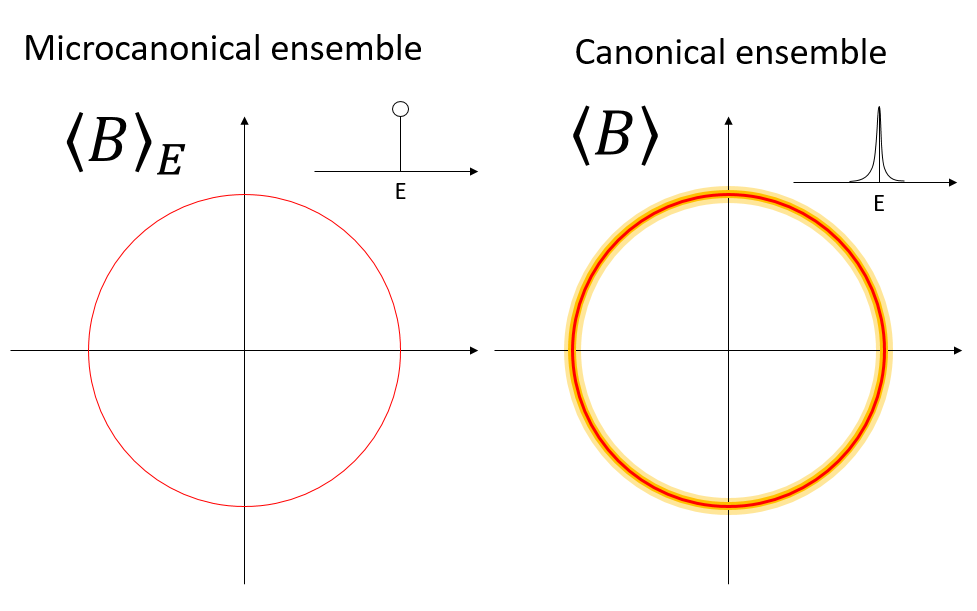

# Generalized Virial Theorem and Microcanonical Temperature

## 一般化ビリアル定理

これまで、Nose-Hoover熱浴やLangevin熱浴で、定常状態が指定の温度のカノニカル分布となることを見てきた。分子動力学法においては、運動エネルギー$K$の定数倍を温度と定義していた。3次元$N$粒子系なら

$$
T = \frac{2K}{3N k_B}
$$

を温度と呼ぶのであった。念のためこれをもう一度導いておこう。

まず、ビリアルと呼ばれる以下の量を定義する。

$$
I = \sum_{i=1}^{3N} p_i \frac{\partial H}{\partial p_i}
$$

なお、以下では次元の自由度は$i$に含める。すなわち、和は$1$から$3N$まで取ることにする。ハミルトニアンが

$$
H = \sum_i \frac{p_i^2}{2m} + V(\{q_i\})
$$

という形をしている時

$$
I = \sum_i 
p_i \frac{\partial H}{\partial p_i} = \sum_i \frac{p_i^2}{m} = 2 K
$$

が成り立つ。これでビリアルが運動エネルギー$K$と結びついた。

また、カノニカル分布が

$$
f = Z^{-1} \exp(-\beta H)
$$

という形をしているとき、物理量$A$のアンサンブル平均は

$$
\left< A \right> \equiv \int A f d\Gamma 
$$

で定義されるのであった。ここで、部分積分から容易に

$$
\left<p_i \frac{\partial H}{\partial p_i} \right> = k_B T
$$

であることから、

$$
\left< I \right> = \sum_i \left<p_i \frac{\partial H}{\partial p_i} \right>  = 3 N k_B T
$$

以上の二式から$I$を消去すると、

$$
2K = 3 N k_B T
$$

こうして運動エネルギーと温度が結びついた。

本質的にはカノニカル分布と部分積分しか使っていないので、$p_i$ではなく$q_i$で微分して

$$
\left< q_i \frac{\partial H}{\partial q_i}\right> = k_B T
$$

も成立し、こちらを状態温度と呼ぶのであった。

さて、上記をさらに一般化しよう。位相空間$\Gamma = (p_i, q_i)$をまとめて、$\vec{z} = (p_1, p_2, \cdots, p_{3N}, q_1, q_2, \cdots, q_{3N})$で表現しよう。

今、位相空間上に、ベクトル場$\vec{B}$を定義する。$\vec{B}$は$3N$次元のベクトルで、その成分$B_i$それぞれについて以下が成り立つことを示すのは容易であろう。

$$
\left<B_i \frac{\partial H}{\partial z_i}\right> = k_B T \left<\frac{\partial B_i}{\partial z_i} \right>
$$

これをベクトル場の言葉で書けば、

$$
\left<\vec{B} \cdot \nabla H \right>
= k_B T \left< \nabla \cdot \vec{B}\right>
$$

この左辺を一般化ビリアル、この式を一般化ビリアル定理(Generalized Virial Theorem)と呼ぶ。

さて、等式が成立するのは、カノニカル分布における平均の時のみであるが、ミクロカノニカル分布における平均においても、上記が漸近的に成立することを示し、それが温度の幾何学的定義となっていることを見てみよう。

なお、物理量の期待値が熱力学極限において一致するのは、ミクロカノニカルとカノニカルで直観的には明らかである。

ミクロカノニカルにおける平均とは、等エネルギー面における期待値である。一方、カノニカル分布では、全位相空間においてボルツマン重みに従って平均を取る必要があるが、$N$が大きければ、その分布はほとんどデルタ関数的になり、エネルギーの期待値$\left<E\right>$もほとんど揺らがないであろう。従って、$N$が大きければミクロカノニカルとカノニカルの区別はつかなくなる。以下では、それを真面目に計算してみる。

## 導出の流れ

我々はハミルトンダイナミクスに従う系で温度を定義したい。ハミルトンダイナミクスではエネルギーが保存されるのであるから、等エネルギー面の面積を使うのが自然であろう。そこで、今考えている位相空間において、あるエネルギー$E$における等エネルギー面の面積を$A(E)$としよう。そして、この系のエントロピー$S$を

$$
S = k_B \ln A
$$

と定義する。ここで、熱力学関係式

$$
\frac{\partial S}{\partial E} = 
\frac{1}{T}
$$

を使って温度を定義することにしよう。しかし、今は我々はハミルトンダイナミクスに従う限りエネルギー$E$は一定であるので、$E$による微分を実行することができない。そこで、別の量を評価し、それが熱力学的極限において温度に一致することを示そう。

具体的には、$B$修正されたエントロピー$S_B$を導入し、これを使って$B$修正された温度を定義する。

$$
\frac{\partial S_B}{\partial E} = 
\frac{1}{T_B}
$$

そして、熱力学極限において、$B$修正された温度が、通常の温度に漸近することを示す。

$$
\lim_{N \rightarrow \infty} T_B = T
$$

## Devivation

3次元$N$粒子系を表現する位相空間$\Gamma$を考える。この空間にハミルトニアン$H$が定義されているとしよう。全位相空間を$\Omega$、あるエネルギー$E$における等エネルギー面(isoenergetic surface)を$A(E)$とすると、$A(E)$は以下のように定義される。

$$
\begin{aligned}
A(E) &= \frac{1}{h^{3N}N!} \int_\Omega \delta(H-E) d \Gamma\\
&= \frac{1}{h^{3N}N!} \int_{A(E)} 
\underbrace{\frac{dA_E}{||\nabla H||}}_{d \mu_E} \\
&= \frac{1}{h^{3N}N!} \int_{A(E)} d \mu_E
\end{aligned}
$$

ここで、$d \mu_E = dA_E / ||\nabla H||$は等エネルギー面の面積要素である。

さて、等エネルギー面の面積が定義できたので、この系のエントロピーを以下のように定義できる。

$$
S = k \ln A
$$

以下では$B$を別の意味に使うため、ボルツマン定数を$k_B$ではなく$k$と表記する。こうして定義されたエントロピーを、ミクロカノニカルエントロピー(microcanonical entropy)と呼ぶことがある。

さて、この式を$A$について解くと、

$$
\exp(S/k) = A
$$

$A(E)$の定義から、

$$
\exp(S/k) = \frac{1}{h^{3N}N!} \int_{A(E)} d \mu_E
$$

次に、この位相空間上に定義されたスカラー関数$B$を考え、等エネルギー面上での平均$\left< B \right>_E$を以下のように定義する。

$$
\left< B \right>_E = \frac{A^{-1}}{h^{3N}N!} \int_{A(E)} B d \mu_E
$$

これを使って、$S_B$という量を定義する。

$$
\begin{aligned}
\exp(S_B/k) &\equiv \exp(S/k) \left< B \right>_E \\
&= \underbrace{\exp(S/k)}_A \frac{A^{-1}}{h^{3N }N!} \int_{A(E)} B d \mu_E \\
&= \frac{1}{h^{3N }N!} \int_{A(E)} B d \mu_E
\end{aligned}
$$

この量$S_B$を$B$修正されたエントロピー(B-modified entropy)とs呼ぼう。これを使って$B$修正された温度(B-modified temperature)$T_B$を定義することができる。

$$
\frac{1}{T_B} \equiv \frac{\partial S_B}{\partial E}
$$

さて、$B$修正されたエントロピーは

$$
\exp(S_B/k) = \frac{1}{h^{3N }N!} \int_{A(E)} B d \mu_E
$$

と書ける。これを両辺$E$で偏微分しよう。

まず、左辺は

$$
\begin{aligned}
\frac{\partial \exp(S_B/k)}{\partial E}
&= \frac{\exp(S_B/k)}{k} \underbrace{\frac{\partial S_B}{\partial E}}_{1/T_B}\\
&= \frac{\exp(S_B/k)}{k T_B}
\end{aligned}
$$

右辺は、積分があるので面倒だが、微分の定義をそのまま書く。

$$
\frac{\partial}{\partial E} \int_{A(E)} B d \mu_E
= \lim_{\delta \rightarrow 0} \frac{1}{\delta}
\left[
  \int_{A(E+\delta)} B d\mu_{E+\delta}
- \int_{A(E)} B d\mu_{E}
\right]
$$

ここで、これまで任意にとってきたスカラー量$B$として、あるベクトル場$\vec{B}$とハミルトニアンの勾配$\nabla H$との内積$\nabla H \cdot \vec{B}$を採用する。

$$
B \equiv \nabla H \cdot \vec{B}
$$

ここで、

$$
d \mu_E = \frac{d A_E}{||\nabla H||}
$$

であったので、

$$
\begin{aligned}
\left< B\right>_E &= \int_{A(E)} \underbrace{B}_{\nabla H \cdot \vec{B}} \quad \underbrace{d\mu_E}_{dA_E / ||\nabla H||}\\
&= \int_{A(E)} \nabla H
\cdot \vec{B} \frac{dA_E}{||\nabla H||} \\
&= \int_{A(E)} \vec{B} 
\cdot \underbrace{\frac{\nabla H}{||\nabla H||}}_{\vec{n}} dA_E \\
&= \int_{A(E)} \vec{B} \vec{n} dA_E
\end{aligned}
$$

ただし、$\vec{n}$は等エネルギー面における単位法線ベクトルである。ベクトル場と等エネルギー面における法線ベクトルの内積を、等エネルギー面上で積分しているので、これはガウスの定理が適用できる。以上から、

$$
\begin{aligned}
\frac{\partial}{\partial E} \int_{A(E)} \underbrace{\nabla H \cdot \vec{B}}_{B} dA_E &= \lim_{\delta \rightarrow 0}
\frac{1}{\delta} \int_E^{E+\delta} dE
\int_{A(E)} \nabla \cdot \vec{B} dA_E \\
&= \int_{A(E)} \nabla \cdot \vec{B} dA_E
\end{aligned}
$$

両辺$h^{3N}N!$で割ると、

$$
\begin{aligned}
\frac{1}{h^{3N}N!}\frac{\partial}{\partial E} \int_{A(E)} B dA_E &= \frac{1}{h^{3N}N!} \int_{A(E)} \nabla \cdot \vec{B} dA_E \\
&= \underbrace{A(E)}_{\exp(S/k)} \left<\nabla \cdot \vec{B} \right>_E\\
&= \exp(S/k) \left<\nabla \cdot \vec{B} \right>_E
\end{aligned}
$$

これが$\exp(S_B/k)/k T_B$に等しいのだから、

$$
\frac{\exp(S_B/k)}{k T_B} = \exp(S/k) \left<\nabla \cdot \vec{B} \right>_E
$$

さて、もともと$B$修正されたエントロピーの定義は

$$
\exp(S_B/k) \equiv \exp(S/k) \left< B \right>_E
$$

であった。今、$B = \nabla H \cdot \vec{B}$としたので、

$$
\exp(S/k) \frac{\left<\nabla H \cdot \vec{B}\right>_E}{k T_B}
= \exp(S/k) \left<\nabla \cdot \vec{B} \right>_E
$$

以上から、

$$
\frac{1}{k T_B} = \frac{\left<\nabla \cdot \vec{B} \right>_E}{\left<\nabla H \cdot \vec{B}\right>_E}
$$

右辺は分子、分母ともに等エネルギー面上での平均なので、ハミルトンダイナミクスのみで求められる量になっている。

さて、$S_B$の定義から、

$$
S_B = S + k \ln \left< B \right>_E
$$

ここで$N$が増加した時に$\left< B \right>_E$の増加が$\exp(N)$より十分に遅ければ、$B$修正されたエントロピーはエントロピーに漸近する。

$$
\lim_{N \rightarrow \infty} S_B = S
$$

同様に、$B$修正された温度$T_B$も$T$に漸近する。

$$
\lim_{N \rightarrow \infty} T_B = T
$$

従って、

$$
\lim_{N \rightarrow \infty}
\frac{\left<\nabla \cdot \vec{B} \right>_E}{\left<\nabla H \cdot \vec{B}\right>_E}
= \frac{1}{kT}
$$

これが一般化ビリアル定理のミクロカノニカル版の証明になっている。

この式は通常のビリアル定理を含んでいる。
例えば$\vec{B}$として

$$
\vec{B} = (p_1, p_2, \cdots, p_{3N}, 0, \cdots ,0)
$$

を選ぶと、

$$
\nabla \cdot \vec{B} = 3N
$$

$$
\nabla H \cdot \vec{B} = \sum_i p_i \frac{\partial H}{\partial p_i} = 2K
$$

となるので、

$$
2K = 3N k T
$$

という、運動温度の定義に帰着する。

## まとめ

## 参考文献

* H. H. Rugh, Phys. Rev. Lett. vol. 78, 772 (1997).
* O. G. Jepps, G. Ayton, and D. J. Evans, Phys. Rev. E vol. 62 4547 (2000).
* C. Braga and K. P. Travis, J. Chem. Phys., vol. 123, 134101 (2005).
